# Ejercicios - Tema 1: Introducción

A continuación, encontrarás ejercicios prácticos sobre la introducción a Git, GitHub y GitLab y sobre trabajar con ramas.

Intenta resolverlos antes de consultar la teoría.

---

## Ejercicio 1. Conceptos básicos

Explica con tus palabras qué es Git y para qué sirve. Después, responde también qué diferencia existe entre Git y GitHub.

```
Git es un programa de control de versiones. GitHub es un servicio online que aloja un 
sistema de control de versiones.

``` 
---

## Ejercicio 2. Instalación de Git

Instala Git en tu equipo según tu sistema operativo. Cuando termines, abre la terminal y ejecuta el comando necesario para comprobar que Git se ha instalado correctamente. Escribe el comando utilizado y anota la versión que te aparece.

```
git --version
```
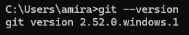

---

## Ejercicio 3. Configuración inicial

Configura Git con tu nombre y tu correo electrónico en modo global. Después, ejecuta el comando necesario para comprobar que la configuración se ha guardado correctamente.

```
git config --list
```
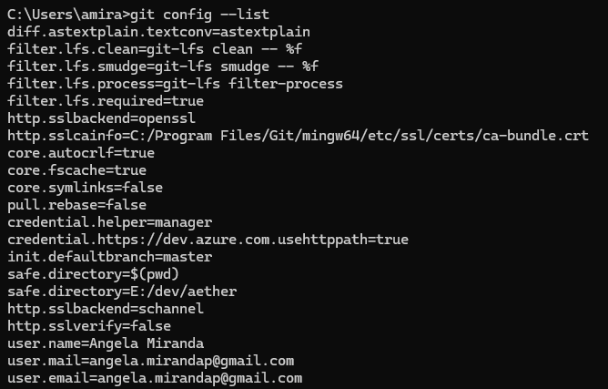

---

## Ejercicio 4. Crear tu primer repositorio

Crea una carpeta llamada `first_repository`. Entra en ella desde la terminal e inicializa un repositorio Git. Después, explica qué carpeta interna crea Git al ejecutar este proceso y cuál es su función.

```
git init
```
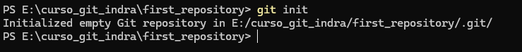

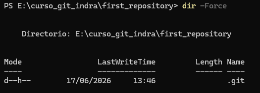

```
Hay una carpeta oculta llamada .git que contiene los cambios en los archivos 
y la configuración del repositorio.
```

---

## Ejercicio 5. Primer archivo y estado del repositorio

Dentro del repositorio anterior, crea un archivo llamado `README.md` con una breve descripción del proyecto. Después, comprueba el estado del repositorio con el comando correspondiente y describe qué información te muestra Git.

```
git status
En la información que muestra en la primera línea:
 - No commits yet: todavía no se ha hecho el commit
 - Untracked files: 
  (use "git add <file>..." to include in what will be committed)
        README.md
   nothing added to commit but untracked files present (use "git add" to track)
   Dice que el archivo README.md no está en seguimiento para poder hacer commit, 
   si queremos hacer commit y que los cambios se guarden habrá que añadir el archivo 
   con el comando git add <nombre-archivo> o "git add ." esto añadirá todos los 
   archivos con cambios, para poder hacer la subida de los cambios al repositorio de forma permanente.

```

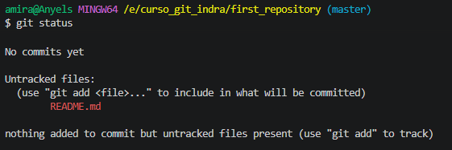

---

## Ejercicio 6. Añadir y guardar cambios

Añade el archivo `README.md` al área de preparación y realiza un primer commit con un mensaje descriptivo. Después, consulta el historial de commits del repositorio.

```
git add README.md o git add .
Ahora al ver el estado con 'git status' muestra la información:
 - On branch master --> dice que está en la rama master
 - No commits yet   --> seguimos sin hacer tener commit
 -  Changes to be committed:
  (use "git rm --cached <file>..." to unstage)
        new file:   README.md
                    --> Cambios que van a ser fijados, te da la información para que si no queires
                     que los cambios hechos en un fichero se fijen, poder sacarlo de la lista lista
                      para commit. Y por último el/los archivo/s que se fijarán en la rama en la que 
                      hagamos el commit. 
```

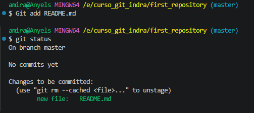

```
git commit -m "primer commit"
[master ...]    --> Indica la rama local donde se guardaron los cambios (master).
(root-commit)   --> Significa que este es el primerísimo commit de la historia de todo el repositorio.
638b3bc         --> Es el identificador único (Hash SHA-1 acortado) de este commit específico. Sirve 
                    para volver a este punto en el futuro si lo necesitas.
primer commit   --> El mensaje descriptivo que se ecribe entre comillas con el parámetro -m.
1 file changed  --> El número de archivos que se modificaron o crearon (1 archivo).
3 insertions(+) --> El número de líneas de código o texto que se añadieron dentro de esos archivos (3 líneas).
create mode 100644 README.md --> Indica que se creó un archivo nuevo llamado README.md. El número
                                 100644 es el permiso estándar de lectura y escritura en sistemas basados en Unix.

```

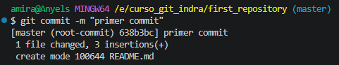

```
git log

commit 638b3bc4d... --> Es el Hash SHA-1 completo (40 caracteres). Es la huella digital única e irrepetible de este 
                        cambio exacto en tu proyecto.
(HEAD -> master)    --> Indica tu posición actual. HEAD es el puntero que dice "estás parado aquí" y master es la
                        rama local en la que te encuentras.
Author:             --> El nombre y correo de la persona que hizo el commit. GitHub usa este correo para asociar 
                        el commit a tu cuenta de usuario.
Date:               --> La fecha exacta, hora y zona horaria en la que se guardó este commit localmente.
primer commit       --> El mensaje que se le ha puesto para recordar qué se hizo en este paso.
```

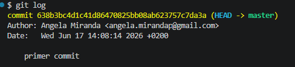

---

## Ejercicio 7. Clonar un repositorio

Investiga qué hace el comando `git clone` y explica en qué situaciones se utiliza. Después, escribe un ejemplo realista de uso con una URL de repositorio.

```
Git clone permite hacer una copia(descarga) de un repostorio remoto.

    - Primero se busca el repositorio que se desee descargar, por ejemplo "freeCodeCamp"
    - Se pulsa el botón <> Code en la ventana que se abre, asegurarse de estar en la pestaña 
      correcta de donde se queira descargar, en nuestro caso "https", se copia la URL
    - Por último abrir crear la carpeta donde se descargrá el proyecto, abrir una consola
      en esa carpeta y escribir "git clone URL" --> git clone https://github.com/freeCodeCamp/freeCodeCamp.git
```
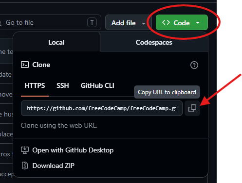

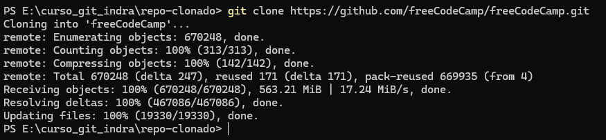


---

## Ejercicio 8. GUI de Git

Busca una interfaz gráfica para trabajar con Git, como GitHub Desktop, SourceTree o la integración de Visual Studio Code. Indica cuál has elegido y responde qué ventajas puede tener usar una GUI frente a trabajar solo con comandos en terminal.

```
He elegido Visual Studio Code (VS Code) por ser la opción más eficiente ya que voy a editar el código ahí,
evitando tener que cambiar de aplicación.
    - Permite ver línea por línea, en pantallas divididas y con colores, que se ha añadido o borrado antes de hacer un commit.
    - Resolver problemas cuando dos personas modifican lo mismo es muy claro, la GUI te muestra botones visuales 
      para elegir qué código conservar.
    - Muestra las ramas, fusiones (merges) y el historial del proyecto como un mapa o gráfico visual fácil 
      de seguir, en lugar de un montón de líneas de texto.
```

---

## Ejercicio 9. GitHub

Crea una cuenta en GitHub, o utiliza una que ya tengas. Después, crea un repositorio remoto llamado `tema1-git`, súbelo a tu perfil y explica qué utilidad tienen plataformas como GitHub en un proyecto de desarrollo.
En el pagina principal de git pulsar el botón "New". 
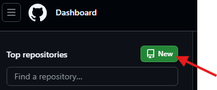

En la  nueva ventana introducir el nombre del nuevo repositorio en la casilla "Repository name*" y dejar el resto de opciones por defecto 
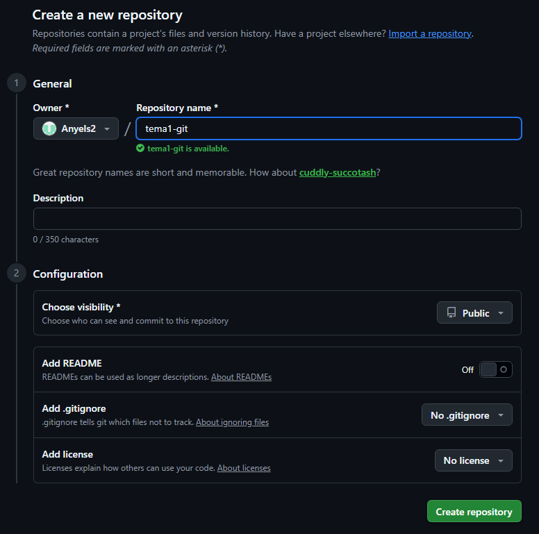

Porque usar GitHub o similares:

    - Respaldo en la Nube   --> Funciona como una copia segura de tu código. Si tu computadora se rompe,
      tu proyecto está a salvo en internet.
    - Colaboración          --> Permite que múltiples programadores trabajen en el mismo proyecto a la vez
                                sin pisarse el trabajo del otr
                                o, fusionando los cambios de forma ordenada.
    - Control de Versiones  --> Mantiene un historial público de quién hizo qué cambio, cuándo y por qué, 
                                facilitando regresar a una versión anterior si algo falla.
    - Comunidad             --> Sirve para compartir y visualizar tu trabajo para que empresas u otros 
                                desarrolladores vean tu código y y puedan participar de él si se desea.

---

## Ejercicio 10. GitLab y comparación final

Investiga qué es GitLab y compáralo brevemente con GitHub. Después, responde qué tienen en común ambas plataformas y menciona al menos una diferencia importante entre ellas.

```
    - Ambas plataformas utilizan Git como sistema de control de versiones. Sus funciones en cuanto a SCV 
      son prácticamente las mismas.

La diferencia principal radica en su filosofía de integración (DevOps):

    - GitLab incluye de forma nativa herramientas avanzadas de Integración Continua y Despliegue Continuo (CI/CD) y
      seguridad en una sola interfaz sin necesidad de configurar extensiones externas.

    - GitHub se centra más en la experiencia del desarrollador y su enorme comunidad,
      delegando a menudo funciones avanzadas a aplicaciones de terceros a través de su Marketplace.
```

---

## Ejercicio 11. Crear y listar ramas

Crea un repositorio nuevo llamado `tema2-ramas` y realiza un primer commit con un archivo `README.md`. Después, crea dos ramas nuevas llamadas `feature/header` y `feature/footer`. Por último, ejecuta el comando necesario para mostrar todas las ramas disponibles e indica cuál es la rama activa.

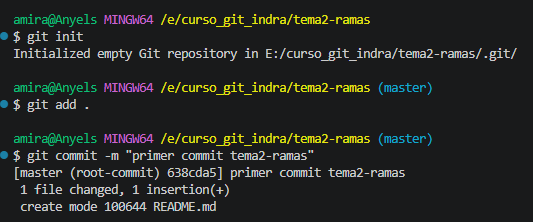
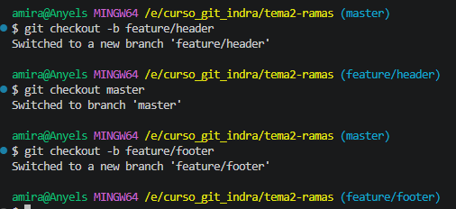
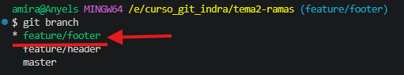

---

## Ejercicio 12. Cambiar entre ramas

Sitúate en la rama `feature/header` y crea un archivo llamado `header.html` con una estructura básica. Haz un commit con un mensaje descriptivo. Después, cambia a la rama `feature/footer` y comprueba si el archivo `header.html` existe también en esa rama. Explica por qué ocurre ese comportamiento.

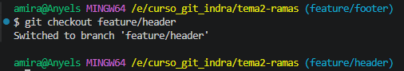
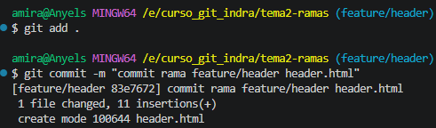
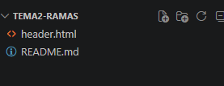
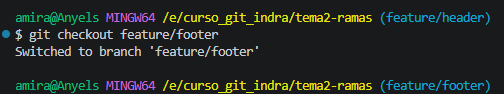
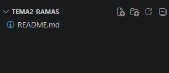

 - El archivo no existe en la rama feature/footer debido que el archivo fue creado en otra rama y solo hemos hecho
 commit, lo que fija los cambios solo en la rama feature/header.

---

## Ejercicio 13. Tipos de ramas

Investiga brevemente para qué se suelen utilizar ramas de tipo `feature`, `bugfix`, `hotfix` y `release`. Después, propón un ejemplo de nombre válido para cada una dentro de un proyecto web.

## Propósito y Nomenclatura de Ramas

| Tipo de Rama | ¿Para qué se utiliza? | Ejemplo de Nombre Válido |
| :--- | :--- | :--- |
| **`feature`** | Para desarrollar **nuevas funcionalidades**, características o pantallas del sitio web. Se crean desde la rama de desarrollo y se borran al terminar. | `feature/login-google` <br> `feature/carrito-compras` |
| **`bugfix`** | Para **corregir errores o fallos** que se encuentran durante la etapa de desarrollo o pruebas, antes de que el código llegue a los usuarios reales. | `bugfix/error-registro` <br> `bugfix/alineacion-footer` |
| **`release`** | Para **preparar una nueva versión** oficial del proyecto. Aquí se hacen pruebas finales, ajustes menores de última hora y documentación antes de lanzarla a producción. | `release/v1.2.0` <br> `release/v2.0-beta` |
| **`hotfix`** | Para **solucionar errores críticos en producción** (la web en vivo). Son urgentes, se crean directamente desde la rama principal (`main`/`master`) y se aplican de inmediato. | `hotfix/caida-pasarela-pago` <br> `hotfix/seguridad-token` |

---

> 💡 **Buenas Prácticas:** 
> Utilizar la barra inclinada (`/`) al inicio del nombre (por ejemplo, `feature/`) permite que las interfaces gráficas (GUIs) agrupen las ramas en carpetas visuales, manteniendo el repositorio ordenado.

---

## Reto final opcional

Si ya has realizado los ejercicios anteriores, intenta conectar tu repositorio local con un repositorio remoto y subir tu primer commit. Puedes hacerlo en GitHub o en GitLab.

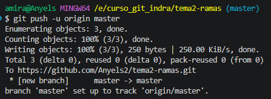
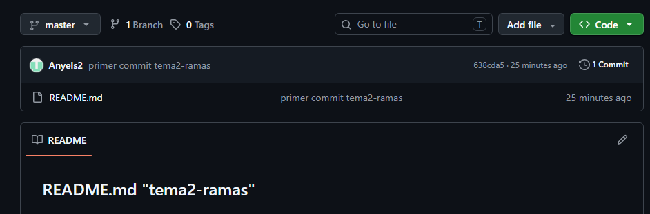